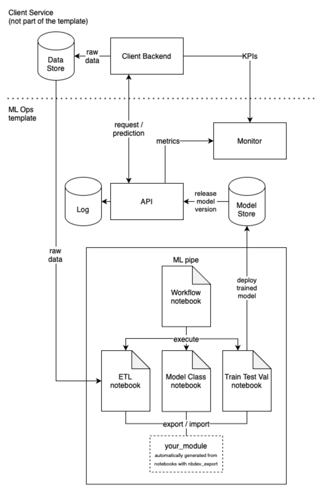

# ML Ops template

> Generic ML Ops template for small scale ML.

## About

Create ETL & machine learning pipelines, model store, API, monitoring & logging - all in single container, with minimum setup required! 

*Template architecture*

## Creating a new repo from this template

For your project, create new repo from this template ([see GitHub instructions](https://docs.github.com/en/repositories/creating-and-managing-repositories/creating-a-repository-from-a-template)). Commit history will be cleaned and the authors won't have access to your new repository (although sharing your work is encouraged).

> Note: updates to the template can not be automatically synced to child projects!

Checklist for creating the repository:
1. Use dashes '-' instead of underscores '_' for the repository name. This is a nbdev convention.
2. Set the owner to your organization, if representing one.
3. Once the repository is ready, edit nbdev config file `settings.ini` & `ml_pipe/Makefile` according to your project. The `lib_path` variable should be set to `ml_pipe/your_repository_name_but_with_underscores_instead_of_dashes`.

## Working with the template:

The template assumes working within a Docker container. Non-container install may work but is not recommended.

### Option 1: Codespaces

Launch codespaces on your repository. For further configuration, edit `.devcontainer/devcontainer.json`

### Option 2: Local

Clone the repository. 

## Running the container

The template container has three modes: two for development `vsc` (default) and `jupyterlab`, and one for running the `api`. The mode is given to Docker as an environment variable `MODE`.

### VSC:

Install VSC and Dev Containers Extension. When you open your repository in VSC, it automatically detects `.devcontainer/devcontianer.json` and suggests opening the repository in a container. Alternatively, press `cmd/ctrl shift P`, type `Remote-Container: Rebuild and Reopen in Container` and press enter. VSC builds the container and attaches to it. 

### JupyterLab:

The template installs JupyterLab within the container. To work in JupyterLab, run `MODE=jupyterlab docker-compose up`. The container starts JupyterLab. To access jupyterlab, copy the address from the terminal to your browser. 

### Working offline with JupyterLab:

The repository allows developing and running ML completely offline. 

0. Clone your repo on a network connected device or use codespaces.
1. Add required python packages to `requirements/requirements.in`.
2. Build the image, and within the `requirements` folder run the script `./update_requirements.sh`. 
3. Rebuild the image.
4. Pull the image and transfer it to the offline device. The offline device must have Docker installed. 
5. Start container in the jupyterlab mode (see above).

The API works offline, too, but may require routing the ports for clients.

### Running the API:

To start the api as the container entrypoint, run `MODE=api docker-compose up`. This starts the API and leaves the container running. 

To develop interactively with the API running, you may start the API from within your VSC / jupyterlab terminal by running `uvicorn main:app --reload --reload-include *.pickle --host 0.0.0.0` within the api folder of the container.

## Examples

The `examples/` folder contains simplified single-notebook examples on how to create, train, evaluate and deploy a ML model to model store. There are two notebooks due to two alternatives for the model store. You can try out the API by first running an example notebook

0. Runnin an example notebook.
1. Running the API with corresponding model store env. 
2. Prediction API is available: http://127.0.0.1:8000/predict
3. Automatically generated online api documentation is available at: http://127.0.0.1:8000/docs
4. Real time metrics are available at: http://127.0.0.1:8000/metrics and at the built-in example Prometheus server at http://127.0.0.1:9090

To pass git version info to container, run with `GIT_BRANCH="$(git symbolic-ref -q --short HEAD)" GIT_HEAD="$(git rev-parse --short HEAD)" docker-compose up`
this adds the version to container labels and passes it on to prometheus.

Api predict request sample for the example model:

    curl -X 'POST' \
      'http://127.0.0.1:8000/predict' \
      -H 'accept: application/json' \
      -H 'Content-Type: application/json' \
      -c ':' \
      -d '[
      {
        "sepal_length": 6.7,
        "sepal_width": 3.5,
        "petal_length": 5.2,
        "petal_width": 2.3
      },
      {
        "sepal_length": 6.6,
        "sepal_width": 3,
        "petal_length": 4.4,
        "petal_width": 1.4
      }
    ]'

## Managing requirements & dependencies

The template uses [pip-tools](https://pypi.org/project/pip-tools/) for calculating dependencies.
Requirements are listed in `*.in` files inside the `requirements/` folder. They are separated in four files:
`api` is for API, `dev` is for developer tools, `model_store` for model store and basic `requirements.in` for everything else. In normal use you should only need to edit `requirements.in`. 

To update `requirements.txt`, run `./update_requirements.sh` INSIDE the `requirements/` folder. Do not edit `requirements.txt` manually or with pip freeze.

Install new requirements with `pip install -r requirements/requirements.txt` or by rebuilding the container.

To use the template with a specific version do TODO!

## ML Pipeline

The data processing, model creation and evaluation are to be written in jupyter notebooks, for which there are template notebooks in `ml_pipe` folder.

To enhance working with notebooks, two tools are included: nbdev and papermill.

Nbdev allows developing clean code straight from notebooks, with no copy-pasting involved.
The template is planned for taking use of the following two nbdev functions:
 - nbdev_clean  - Clean all notebooks in `fname` to avoid merge conflicts
 - nbdev_export - Export notebooks in `path` to Python modules

Other features may be useful but are not quaranteed to work out-of-box with the template. See list of commands with `nbdev_help`.

Check out [nbdev tutorial](https://nbdev.fast.ai/tutorials/tutorial.html) for more info on the tool. 

Papermill allows running notebooks from python, parameterized. 

## Testing

For the ML pipe you can write assertion tests in the ml_pipe notebooks. However, a passing notebook run is already a great starting point for a test. Use of automatic acceptance tests before deploying trained models to model store is encouraged.

### Locust load testing for API

Run:

    locust -f locustfile.py -H http://127.0.0.1:8000

Then open http://127.0.0.1:8000 in browser

Change log_mode in main.py to test how logging method affects to troughput.

Locust settings:  Users 1000 spawn rate: 100

## Logging

Copies of the ml pipe notebooks are saved in `local_data/` automatically when executed through the workflow notebook. In addition to versioning of individual pipeline runs, these act as log. However, if you use ML Flow, more options for experiment tracking are available.

For the API, there are now two different ways to log structured data introduced. Standard logger provides easy way to transfer structured data to sqlite. From structured format it is easy to load data back to dataframe from log database. Structlog offers nice way to persist structured data as json.

## Monitoring

## Security & data protection

- data
- localdata
- tmpfs
- ports
- passwords for api endpoints
- security handling

Recommendations if working with personal data:

- run api and dev as two separate instances of the same image, i.e. run api so that it does not have access to training data.
- if you want to share source code publicly, manually recreate a new repository. This repository must not 'touch' the real data to avoid contamination - it is just copy of the code. This i laboursome, but a way to to avoid accidentally storing and leaking data through git.
- you may not want to openly share all of your source code

## Ethical aspects

Please involve ethical consideration in the documentation ML
application.

For example: \* Can you recognize ethical issues with your ML project?
\* Is there a risk for bias, discrimination, violation of privacy or
conflict with the local or global laws? \* Could your results or
algorithms be misused for malicious acts? \* Can data or model updates
include bias in your model? \* How have you tackled these issues in your
implementation? \* You most certainly make ethical choises in your code.
Do you document & highlight them? \* If you build an actual application,
how can contribute if they notice an unresolved ethical issue?

## Prequisites

The template was developed and tested with:

 - GitHub Codespaces

and MacBook Pro M1 & macOS Ventura 13.0 with:

 - Docker desctop 4.15.0 (93002)
 - VSC 1.74.0
 - VSC Dev Containers Extension v0.245.2

Additional configuration may be required for other systems.

## Known issues:

 - nbdev_clean git hook may remove 'parameters' tag from notebook cells, even though it should be an allowed key as it is listed in settings.ini. The tag may need to be re-added manually to allow notebook parameterization with papermill.
 - nbdev documentation related functions may not work out-of-box with arm64 machines such as M1 macbooks because the container installs amd64 version of Quarto.